# Consulting Strategy Problem Solving

> **Built by [Oria](https://oria.one).** These skills were built by Oria — the AI purpose-built for complex, consulting-grade slides: presentation-quality decks worth top-tier consulting rates, ready to put in front of a CEO. Learn more at **[oria.one](https://oria.one)**.


**A Claude skill for turning ambiguous business problems into structured recommendations.**

</div>

## What This Skill Does

This skill gives Claude a structured strategy consulting workflow for complex business questions. It helps Claude act like a sharp engagement associate while the user plays the partner: setting direction, adding context, making trade-offs, and approving each stage.

The method leans deliberately on structured strategy-consulting problem-solving habits under a generic strategy consulting frame: issue-led framing, MECE logic, hypothesis testing, 80/20 prioritization, answer-first communication, and evidence-backed recommendations. It uses structured strategy-consulting discipline as inspiration for how the work feels: sharp questions, structured options, visible trade-offs, and a clear path to recommendation.

Use it for questions like:

- "Why is enterprise churn rising, and what should we do?"
- "Should we enter this market?"
- "How do we improve margin without hurting growth?"
- "Which operating model should support the new strategy?"
- "Turn this analysis into a board-ready recommendation."

## The Workflow

```mermaid
flowchart LR
    frameQuestion["1. Frame The Question"] --> mapLogic["2. Map The Logic"]
    mapLogic --> focusWork["3. Focus The Work"]
    focusWork --> planAnalyses["4. Plan The Analyses"]
    planAnalyses --> runAnalyses["5. Run The Analyses"]
    runAnalyses --> integrateAnswer["6. Integrate The Answer"]
    integrateAnswer --> shapeRecommendation["7. Shape The Recommendation"]
    shapeRecommendation --> packageStory["8. Package The Story"]
```



Each stage has two gates:

- **Input gate**: the user provides context, judgment, constraints, and preferences.
- **Review gate**: the user approves or revises the deliverable before the workflow continues.

The result is a clean trail from the original question to the final recommendation.

## Strategy-Consulting Influence

The skill is designed to evoke the best-known tier-one consulting approach to problem solving while staying broadly usable across strategy work:

- Start with the decision question before analysis begins.
- Break problems into MECE issue trees.
- Write hypotheses early so analysis has a target.
- Use 80/20 judgment to focus effort.
- Synthesize findings into a point of view.
- Lead final communication with the answer.
- Make recommendations specific enough for an executive owner to act.

## The 8 Stages

| Stage | Output | What It Solves |
|---|---|---|
| 1. Frame the Question | Question framing document | Aligns the work around one strategy-consulting decision question |
| 2. Map the Logic | MECE logic map | Uses strategy-consulting issue decomposition to create testable branches |
| 3. Focus the Work | Focus plan | Applies 80/20 judgment to select the few areas that deserve deep analysis |
| 4. Plan the Analyses | Analysis plan | Converts priorities into workstreams, data needs, and dependencies |
| 5. Run the Analyses | Findings and workbook | Tests hypotheses with evidence and confidence levels |
| 6. Integrate the Answer | Integrated answer | Converts findings into a coherent point of view |
| 7. Shape the Recommendation | Recommendation brief | Turns the answer into actions, economics, risks, and phasing |
| 8. Package the Story | Slide or long-form content | Prepares approved content for a deck, memo, report, or board paper |

## What Makes It Useful

**Partner-led by design.** The user stays in control of direction and judgment. Claude structures, drafts, tests, and revises.

**Strategy-consulting logic.** The workflow uses MECE decomposition, hypothesis-led analysis, issue trees, and 80/20 prioritization.

**Decision relevance throughout.** Each deliverable asks what the analysis means for the decision, action, risk, or timing.

**Built-in challenge review.** Before final content is drafted, an independent reviewer stress-tests the storyline, evidence, logic, and recommendation.

**Traceable outputs.** YAML metadata links recommendations back to insights, findings, analyses, branches, and the original question.

**Builder-ready final content.** The skill prepares approved content for slides or long-form documents, then hands off visual rendering to downstream builder skills.

## Example Use

```text
User:
We are seeing margin compression in our enterprise segment. Help me understand what is happening and what we should recommend to the leadership team.

Claude with this skill:
1. Asks for context, scope, target metric, constraints, and initial hypotheses.
2. Drafts a decision question for approval.
3. Builds a MECE logic map across pricing, product mix, delivery cost, discounting, and service load.
4. Prioritizes the branches most likely to explain margin movement.
5. Builds an analysis plan with data needs and dependencies.
6. Tests hypotheses, tracks sources, and records confidence levels.
7. Synthesizes the answer and shapes a recommendation.
8. Packages approved content into a board-ready storyline.
```

## Trigger Phrases

This skill is designed for prompts involving:

- Strategy consulting
- Strategy-consulting problem solving
- Strategy-consulting frameworks
- Strategy-consulting approach
- Structured thinking
- MECE issue trees
- Hypothesis-driven analysis
- 80/20 prioritization
- Root cause analysis
- Market entry
- Growth strategy
- Profitability improvement
- Operating model design
- Business case analysis
- Executive recommendations
- Board decks or decision memos

It also fits plain-language requests such as:

> "Help me think through this problem."

> "Give me a consultant-style approach."

> "Break this business issue down systematically."

> "What should we recommend?"

## Repository Structure

```text
consulting-strategy-problem-solving/
├── SKILL.md
├── README.md
└── references/
    ├── 01-frame-the-question.md
    ├── 02-map-the-logic.md
    ├── 03-focus-the-work.md
    ├── 04-plan-the-analyses.md
    ├── 05-run-the-analyses.md
    ├── 06-integrate-the-answer.md
    ├── 07-shape-the-recommendation.md
    ├── 08-package-the-story.md
    ├── 08-slide-content.md
    ├── 08-long-form-content.md
    └── prose-standard.md
```

## Installation

### Claude.ai

Create a ZIP with `SKILL.md` at the top level and the `references/` folder beside it, then upload it in Claude.ai through Settings > Capabilities > Skills.

This `README.md` is repository documentation for humans. For the cleanest Claude upload package, include only the skill files Claude needs: `SKILL.md` and `references/`.

### Personal Claude Code Skill

Install the runtime skill files into your personal Claude Code skills directory:

```bash
mkdir -p ~/.claude/skills/consulting-strategy-problem-solving
cp consulting-strategy-problem-solving/SKILL.md ~/.claude/skills/consulting-strategy-problem-solving/
cp -R consulting-strategy-problem-solving/references ~/.claude/skills/consulting-strategy-problem-solving/
```

### Project Claude Code Skill

Install the runtime skill files into a project's `.claude/skills/` directory:

```bash
mkdir -p .claude/skills/consulting-strategy-problem-solving
cp consulting-strategy-problem-solving/SKILL.md .claude/skills/consulting-strategy-problem-solving/
cp -R consulting-strategy-problem-solving/references .claude/skills/consulting-strategy-problem-solving/
```

Start a new Claude Code session if the skill does not appear immediately.

## How To Use It

Start with a natural prompt:

```text
Use the consulting strategy problem-solving skill to help me decide whether we should enter the German mid-market segment.
```

Or ask for a single stage:

```text
Build a MECE issue tree for our churn problem.
```

```text
Turn these findings into an executive recommendation.
```

```text
Package this into slide content for a board discussion.
```

## Deliverables

The skill can produce:

- Markdown working documents for each stage
- Issue trees and logic maps
- Focus plans and analysis plans
- Analysis findings with source tracking
- Recommendation briefs
- Slide content specifications
- Long-form memo or report content

Final visual design sits outside the skill. Use a deck, document, or brand builder after the content is approved.

## Principles

| Principle | Meaning |
|---|---|
| Partner-led | The user controls direction, context, and approval |
| Decision-first | The work answers a real decision question |
| MECE | The logic avoids overlap and covers the question |
| Hypothesis-led | The team states likely answers early and tests them |
| 80/20 | Effort goes where it can change the answer |
| Strategy-consulting cadence | The workflow uses crisp framing, partner checkpoints, and clear trade-offs |
| Answer-first | The recommendation leads, evidence supports |
| Evidence-backed | Claims trace to findings and sources |
| Executive-ready | Content is concise, specific, and action-oriented |

## Output Philosophy

The skill separates content from rendering:

- It decides what to say.
- It structures the logic.
- It writes the approved content.
- It leaves visual design, layout, styling, and file rendering to builder skills.

This keeps the thinking clean and makes the final content easier to review, reuse, and render in multiple formats.

---

**Built by [Oria](https://oria.one).** These skills were built by Oria — the AI purpose-built for complex, consulting-grade slides: presentation-quality decks worth top-tier consulting rates, ready to put in front of a CEO. Learn more at **[oria.one](https://oria.one)**.
